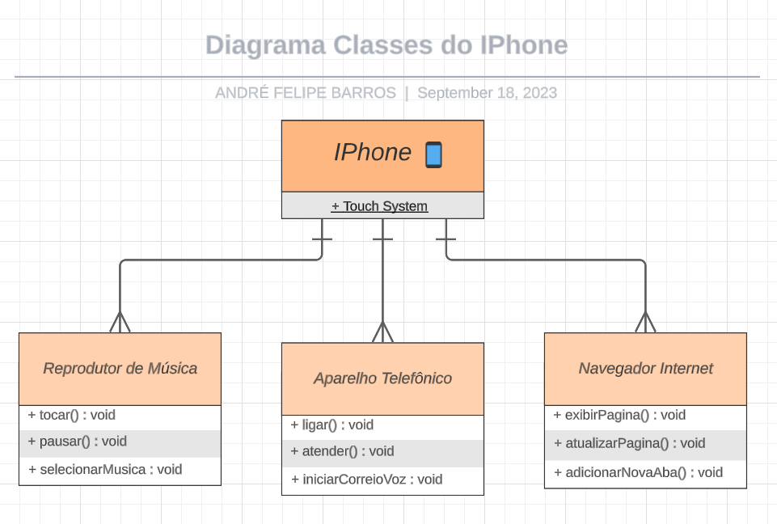

# Desafio: Orientação a Objetos e UML: (Diagramação de Classes do iPhone)
<h2> Sobre: </h2>
    Desenvolvi um UML de diagramação de classes com a proposta de representar os papéis do iPhone de: Reprodutor Musicial, Aparelho Telefônico e Navegador na Internet.
    Desafio proposto com base no vídeo de lançamento do iPhone conforme link abaixo:
    

    
<h2> Comportamentos: </h2>
<ul>
    <li>Repodutor Musicial: tocar, pausar, selecionarMusica</li>
    <li>Aparelho Telefônico: ligar, atender, iniciarCorrerioVoz</li>
    <li>Navegador na Internet: exibirPagina, adicionarNovaAba, atualizarPagina+</li>
</ul>

<h2>Representação em UML: </h2>
    

